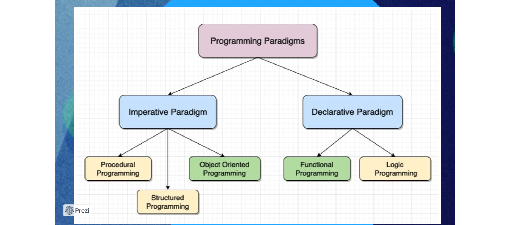

Títulos

# Título H1
## Título H2
### Título H3

**Negrito** e *Itálico*

Lista:
* Item 1
* Item 2

Click [aqui] (https://www.google.com/url?sa=i&url=https%3A%2F%2Ftenor.com%2Fsearch%2Fmustache-guy-gifs&psig=AOvVaw2xGFpaBXfLyywrE2aGmeD3&ust=1711492833059000&source=images&cd=vfe&opi=89978449&ved=0CBIQjRxqFwoTCJDc9Oa9kIUDFQAAAAAdAAAAABAE)

# Paradigma de programação:
É um conjunto de regras a serem seguidas para definir como o código deve ser escrito e organizado.

# Abordagens:

### Paradigma Imperativo:
    É uma sequência de instruções feitas uma a uma que direciona como o programa vai ser executado.
### Paradigma Declarativo:
    O objetivo é focar na lógica e alcançar o resultado, não se importando muito como foi feitor.

## Exemplos Imperativa:

* **Estruturada:**
    Visa melhorar a legibilidade e a reutilização do código, usando blocos de fluxo de controle do programa, blocos de tomada de decisão, construções de iteração e funções.

* **Procedural:**
    Baeado no conceito de chamadas de procedimento. É uma série de instruções dizendo o que o ocmputador tem que fazer passo a passo

## Exemplos Declarativa:

* **Funcional:**
    Não existe uma lista de intruções. Para ela, tudo são funções. É uma sequência de funões matemáticas que juntas resolvem um problema.

* **Lógica:**
    O foco é declarar fatos e regras que podem ser utilizados para deduzir novas soluções. O programador só precisa definir qual parte do problema ele quer resolver, e o sistema procura a melhor solução para resolve-lo.

## Conceito:

# POO:
    Se baseia na criação de objetos que possuem propriedades e métodos, permitindo o encapsulamento dos dados e a reutilização do código. Todos os componentes do programa são representados como objetos.

## Pilares:
* **Herança:**
    Criação de novas classes com base em classes existentes.

* **Poliformismo:**
    Capacidade de um objeto se passar por outro compatível.

* **Encapsulamento:**
    Gerenciamento do acesso a atributos e métodos.

* **Abstração:**
    Representação de conceitos essenciais do mundo real.

## Benefícios:
* **Reutilização de código:**
    A poo permite aproveitar classes e objetos já existentes.

* **Modularidade:**
    A POO incentiva a divisão do código em módulos independentes.

* **Flexibilidade e escalabilidade:**
    Flexibilidade no design de software, permitindo adicionar novas funcionalidades e modificar o comportamento dos objetos sem afetar outras partes do sistema.

* **Organização e coesão do código:**
    A lógica de programação é estruturada de maneira clara e compreensível. 

# Java:
* Multiparadigma
* Procedural
* Estruturado
* POO
* Programação concorrente
* Funcional (A partir do Java 8*)

