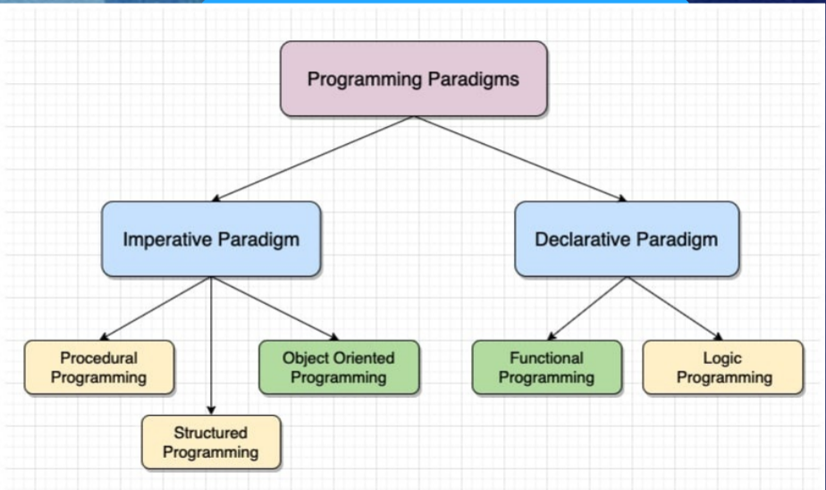

Titulos 

# Titulo H1
## Titulo H2
### Titulo H3

NEGRITO E ITALICO

**Negrito** ou _Italico_

Lista
* Item 1 
* Item 2

Links e Imagens

[Link para Google](https://www.google.com)

# Introdução
 
  sobre a aula de hoje, incluindo o uso do Markdown para formatação de texto, os diferentes paradigmas de programação e suas abordagens.

# Markdown

Markdown. Trata-se de uma linguagem de marcação simples e fácil de usar, usamos para formatar textos de maneira eficaz, principalmente na web com o Markdown, podemos adicionar formatações básicas como **negrito**, _itálico_, títulos, listas, links e imagens usando uma sintaxe intuitiva e leve.

# Paradigmas de Programação

Paradigmas de programação são conjuntos de regras e conceitos que determinam como o código de um programa é escrito e organizado. Existem diferentes abordagens nesse sentido, sendo as principais o **paradigma imperativo** e o **paradigma declarativo**.

## Abordagens dos Paradigmas

### Paradigma Imperativo

O paradigma imperativo orienta a execução do programa por meio de comandos, seguindo uma sequência de instruções por instrução. Identificamos a programação estruturada como uma forma de organizar o código de maneira clara.

### Paradigma Declarativo

O paradigma declarativo foca na lógica do programa e no resultado desejado, sem se preocupar tanto com o controle de fluxo. Destacamos a programação funcional, que trata tudo como funções matemáticas, evitando a mudança de estado e dados mutáveis; e a programação lógica, que se baseia em fatos e regras para resolver problemas de forma eficiente.

## Exemplos de Paradigmas

### Paradigma Imperativo

- Programação Procedural: Organiza o código em procedimentos ou funções, seguindo uma abordagem linear de execução.

- Programação Estruturada: Organiza o código em blocos de controle de fluxo, tomada de decisão e construções de iteração.

- Programação Orientada a Objetos: Baseada em objetos que possuem atributos e métodos, permitindo o encapsulamento, herança e polimorfismo.

### Paradigma Declarativo

- Programação Funcional: Trata tudo como funções matemáticas, evitando a mudança de estado e dados mutáveis. Exemplos de linguagens incluem Haskell, Scala e Clojure.

- Programação Lógica: Baseia-se em fatos e regras para inferir novas informações e soluções. Exemplos de linguagens incluem Prolog e DataLog.

## exemplo 

# Conclusão

Os paradigmas de programação oferecem diferentes abordagens para resolver problemas de maneira eficiente e elegante. A compreensão desses paradigmas é essencial para escolher a melhor abordagem em cada situação e desenvolver soluções robustas e eficientes.