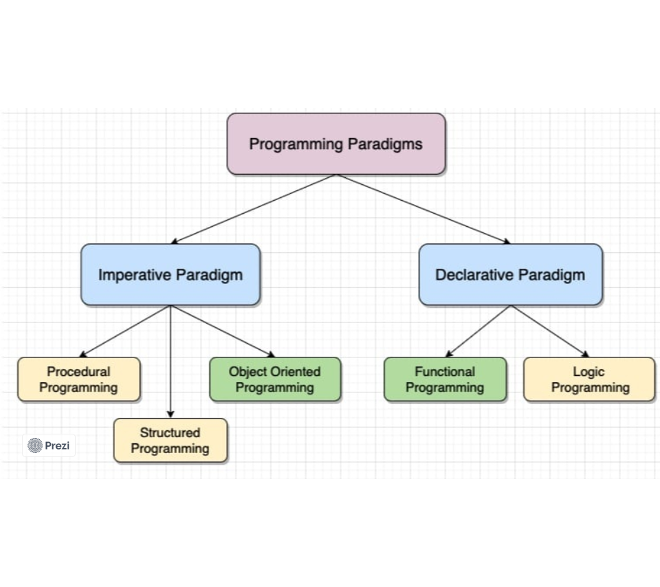

# Markdown
Oque seria isso?

É literalmente isso, escrever bonitinho.

# Paradigma da programação

É um conjunto de regras, com princípios, conceitos e design que define a organização de um código. 

Ligado à o estilo de escrita e organização do código.

## Paradigma Imperativo
Segue uma sequência de instruções, e cada declaração orienta o que deve ser feito e como deve ser feito.

### Estruturada
É um jeito simples e bem utilizado nos tempos atuais, trazendo:(if else) e os loops como:(for e while) 

### Procedural
É uma lista de instruções dizendo o que o computador o que deve ser feito passo a passo. as primeiras linguagem de programação são procedurais

* C
* C++
* Java
* Pascal

## Paradigma declarativos
Foca mais na logica em si, e no resultado, resumindo os fins justifica os meios, o importante é funcionar.

### funcional

 Tudo são funções, não tem lista de instruções ou objetos para o computador realizar, mas sim sequência de funções matemática  que no final, vai resolver um problema.

* Haskell
* Scala
* JS
* Clojure

### Lógica

    A lógica define o que deve ser resolvido enquanto o controle define como deve ser resolvido.

    A vantagem é que o programador só vai definir qual parte do problema quer resolver, e o sistema encontra a melhor solução para esse problema.

    O negócio é declarar fatos e regras que possam ser utilizados para inferir novas informações e soluções.

    * Prolog
    * DataLog

# POO (**Programação Orientada a Objetos**)

    Criada na época de 70 por Alan Kay, como nome diz é baseado na criação de Objetos que possuem propriedades e métodos, permitindo o encapsulamento de dados e a reutilização de código.

## Pilares

### Herança
    criação de novas classes com base em uma classe já existentes

### Polimorfismo
    Trata-se da capacidade de um objeto conseguir se passar com outro compatível.

### Encapsulamento
    Gerenciamento de acesso a atributos e métodos.

### Abstração 
    Conceitos essenciais do mundo real.

## Benefícios

**Reutilização** de código, usando classes e objetos já existentes.

**Modularidade** divisão do código em módulos independentes.

**Flexibilidade e escalabilidade** consegue adicionar novas funções e modificar o comportamento de objetos sem afetar as outras partes do sistema.

**Organização e coesão do código** com o POO é mais organizado e coeso.

# Java

* Multiparadigma
* Procedural
* Estruturado
* POO
* Programação concorrente
* Funcional