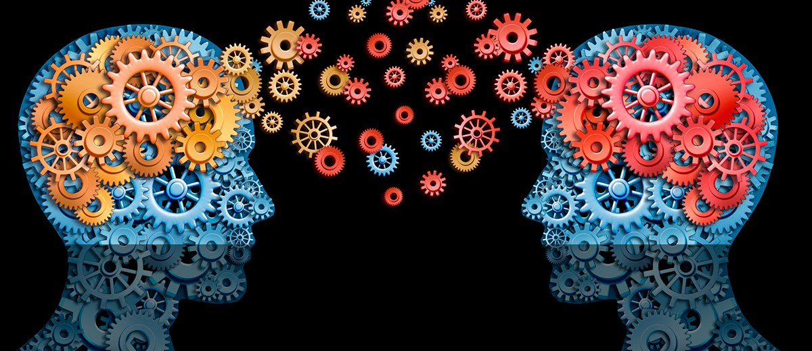

# 🍵 PARADIGMAS DA PROGRAMAÇÃO 🍵

## ☢️ O que é um paradigma? ☢️

O paradigma é basicamente uma maneira específica de **ver e entender** o mundo ao nosso redor. É como uma lente pela qual interpretamos e organizamos nossas experiências, ideias e conhecimentos. É o conjunto de regras, principios, conceitos de design que definem como você vai resolver um problema, ou ainda o conjuto de regras que norteia nosso desenvolvimento.

---

## ⚠️ Paradigma imperativo ⚠️

    Dirigido por comando, voce deve dizer para o computador o passo a passo para atingir o resultado esperado, para chegar na solução.

                    ** FOCO EM COMO EXECUTAR! **
        

## *Tipos:*

### Programação Orientada a Objetos 

Criado por Alan Kay, viram que apenas com a linguagem estruturarada e procedimental não eram ainda resolvidos sistemas complexos, precisavamaos de algo que fornecesse mais abstração.

 🗝️ Pilares:   
- Herança - Classe herda de outra;
- Poliformismo - Objeto se comporta de várias formas;
- Encapsulamnto - proteger os atributos;
- Abstração - Trazer todos esses conceitos para a máquina, representação na essência.

*Benefícios:*
- Reutilização de código;
- Modulariedade;
- Flexibilidade e escabilidade: mais fácil representear quando você tem uma representação do mundo real no sistema;
- Organização e coesão de código.

### Programação Estruturada 

Fazer blocos condicionais, estuturas de loop, **pequenas estruturas**, **blocos de fluxo**, melhorar legibilidade e reutilização de código.
        
### Programação Procedural 

Dividir sua solução em **procedimentos reutilizaveis**, métodos e funções, quebrar o código em partes.

---

## 🎯 Paradigma Declarativo 🎯

    Maior atenção aos resultados do que como vai será executado, tem grande auxilio da linguagem, você não se importa como vai ser utilizado. 
    "Os fins justificam os meios".

                        **FOCO EM EXECUTAR!**

## *Tipos:*

### Programação Funcional 

Foco em **imutabilidade**, manter o estado, utilização de muitas funções mantemáticas, utiliza o recurso 'lambda'.

### Programação Lógica

Onde são definidos as regras e fatos de tudo que será executado, com base nesses dados e fatos que foram alimentados.
Muito utilizado em IA, infere pensando exatamente no resultado.

---

# JAVA

    
    - Multiparadigma
    - Procedural
    - Estruturada
    - POO
    - Programação concorrente
    - Funcional (apartir do java 8)